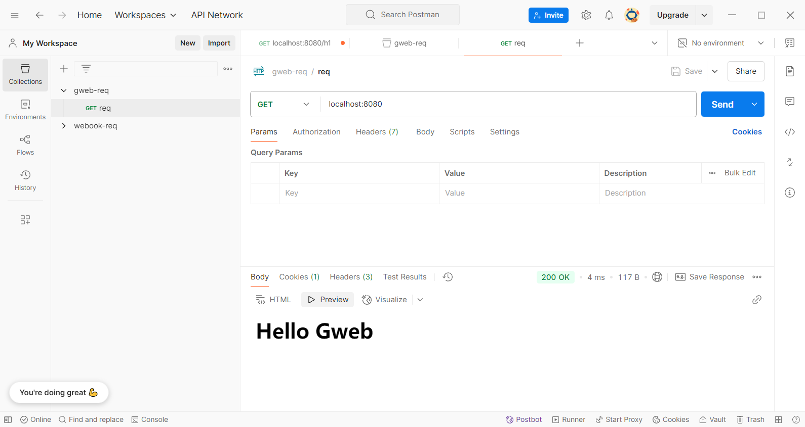
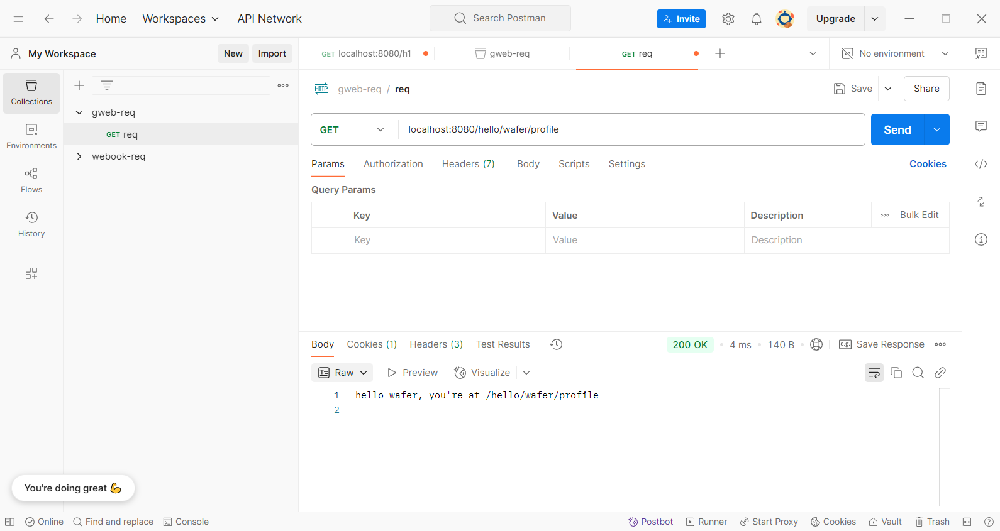
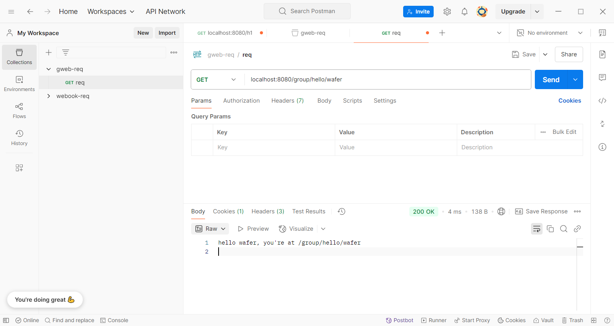
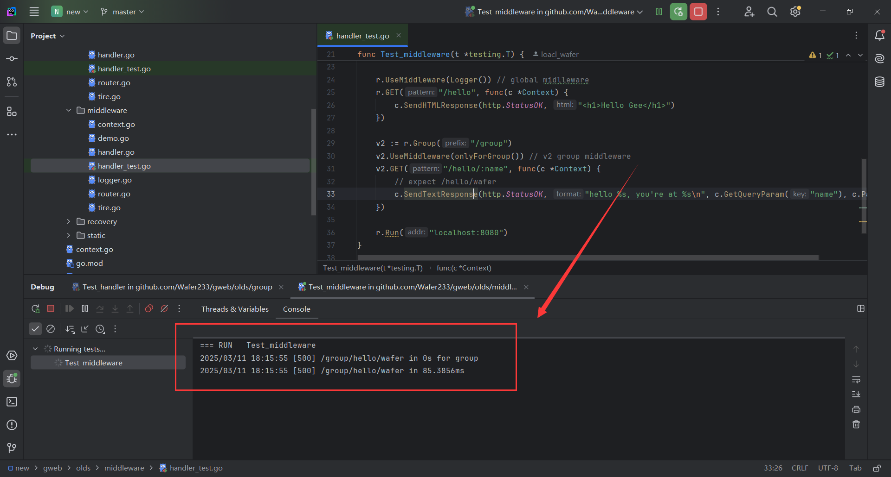
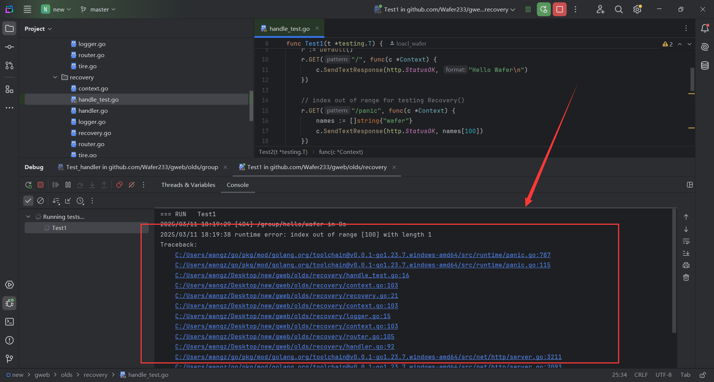

# gweb

## Preface
This project is a simple Go web framework based on net/http, implementing some basic functionalities similar to those in `gin`. Due to my limited capabilities, this project references another [open-source](https://geektutu.com/post/gee.html) project for guidance.

## Why gweb
As we all know, `net/http` provides fundamental web functionalities, such as listening on ports, mapping static routes, and parsing HTTP messages. However, directly using net/http in actual development can be quite cumbersome. 

Therefore, I have implemented several essential features, including creating a gweb instance, adding routes, and finally starting the web service. Through this process, I have also gained a deeper understanding of `gin` and other web frameworks.


## Run gweb
A basic example:
```
package main

import (
	"github.com/Wafer233/gweb"
	"net/http"
)

func main() {
	route := gweb.Default()
	route.POST("/", func(ctx *gweb.Context) {
		ctx.SendTextResponse(http.StatusOK, "Hello Wafer")
	})
	route.Run("localhost:8080")
}
```
Then visit `localhost:8080/` in your browser to see the response!

## Dev Record

### Preface
This this the record of optimize the func of gweb, the screen is on `Postman` and `Goland`.

### Static
Simplify the web service startup process.

A quick start eaxmple.


### Context

Extract the `router` as an independent component to facilitate future enhancements.

Design a `Context` to encapsulate Request and Response, providing support for response types such as `JSON` and `HTML`.

A example using `SendHTMLResponse()`.




### Dynamic

Implement dynamic route parsing using a Trie tree, supporting two patterns.

`:name` – Represents a parameterized segment (e.g., `/user/:name` matches `/user/alice`).
`*filepath` – Matches any remaining path as a wildcard (e.g., `/static/*filepath` matches `/static/css/style.css`).

A eample using `:name`




### Group

Implement route group control.

A eample using `Group()`




### Middleware
Design and implement middleware mechanism for a Web framework.

Implement `Logger` middleware

A `logger` middleware example in the terminal




### Recovery

Implement `Recovery` middleware

Add a `default()` to use `Logger` middleware and `Recovery` middleware default

A `recovery` middleware example in the terminal, panic and recover, print the log.




