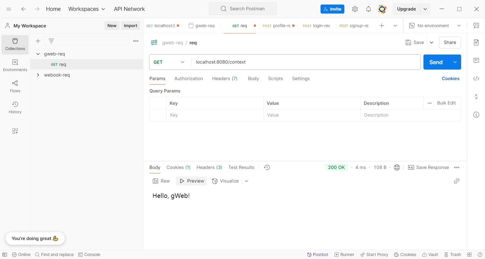
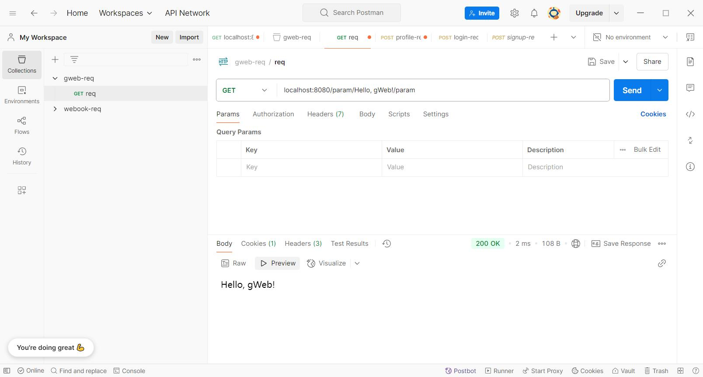
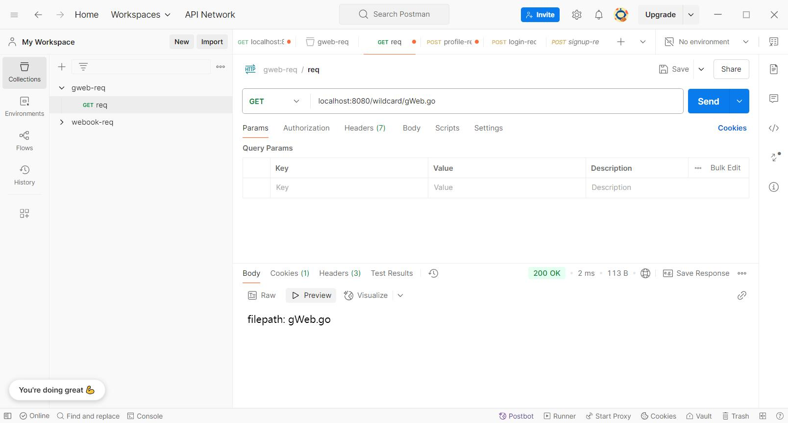
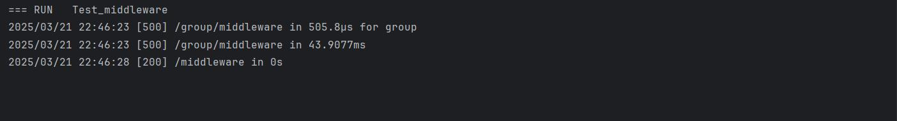
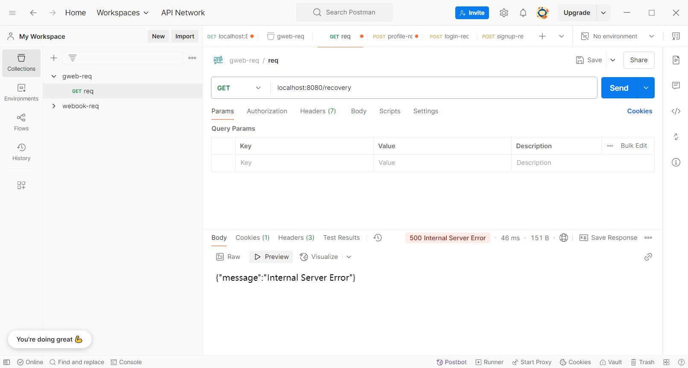
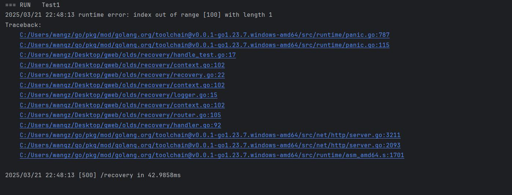

# gweb

## Preface
This project is a simple Go web framework based on net/http, implementing some basic functionalities similar to those in `gin`.

## Why gWeb
As we all know, `net/http` provides fundamental web functionalities, such as listening on ports, mapping static routes, and parsing HTTP messages. However, directly using net/http in actual development can be quite cumbersome. 

Therefore, I have implemented several essential features, including creating a gweb instance, adding routes, and finally starting the web service. Through this process, I have also gained a deeper understanding of `gin` and other web frameworks.


## Run gWeb
Put the following code inside of an empty `.go` file.
```
package main

import (
	"github.com/Wafer233/gweb"
	"net/http"
)

func main() {
	route := gweb.Default()
	route.POST("/", func(ctx *gweb.Context) {
		ctx.SendTextResponse(http.StatusOK, "Hello Wafer")
	})
	route.Run("localhost:8080")
}
```
Then visit `localhost:8080/` in your browser to see the response!

## Feature


### Static Route
#### Get Start
```
func main() {
	r := gweb.New()
	r.GET("/static", func(w http.ResponseWriter, req *http.Request) {
		fmt.Fprint(w, "Hello, gWeb!")
	})
	r.Run("localhost:8080")
}
```
#### Explanation
1. Use `New()` to create an instance of gweb.
2. Add a route using the `GET()` method.
3. Start the web service with `Run()`.
4. Use `POST()` is optional.


#### Postman


### Context
#### Get Start
```
func main() {
	r := gweb.New()
	r.GET("/context", func(c *Context) {
		c.SendTextResponse(http.StatusOK, "Hello, gWeb!")
	})
	r.Run("localhost:8080")
}
```


#### Explanation
1. Use `New()` to create an instance of gweb.
2. Add a route using the `GET()` method.
3. Send a response using `SendHTMLResponse()`.
4. Start the web service with `Run()`.
5. `GetFormValue()` `GetQueryParam()` `SendTextResponse()` `SendJSONResponse()` `Hash` are optional.

#### Postman


### Dynamic Route


#### Get start

```
func main() {

	r := gweb.New()
	// expect /param/:words/param
	r.GET("/param/:words/param", func(c *Context) {
		c.SendTextResponse(http.StatusOK, "%s", c.GetDynamicParam("words"))
	})
	// expect /wildcard/gWeb.go
	r.GET("/wildcard/*filepath", func(c *Context) {
		c.SendTextResponse(http.StatusOK, "filepath: %s", c.GetDynamicParam("filepath"))
	})
	r.Run("localhost:8080")

}
```
#### Explanation
1. Use `New()` to create an instance of gweb.
2. Add a route using the `GET()` method.
3. Use two kinds of dynamic route.
4. Start the web service with `Run()`.

#### Postman



### Group
#### Get start
```
func main() {
	r := gweb.New()
	// expect /group/hello
	group := r.Group("/group")
	group.GET("/hello", func(c *Context) {
		c.SendTextResponse(http.StatusOK, "Hello, gWeb!")
	})
	r.Run("localhost:8080")
}
```

#### Explanation
1. Use `New()` to create an instance of gweb.
2. Add a group using the `Group()` method.
3. Add a route using the `GET()` method.
4. Start the web service with `Run()`.
#### Postman

### Middleware

#### Get start
func main() {
	r := gweb.New()
	r.UseMiddleware(Logger())
	r.GET("/middleware", func(c *Context) {
		c.SendTextResponse(http.StatusOK, "Hello, gWeb!")
	})
	r.Run("localhost:8080")
}
#### Explanation
1. Use `New()` to create an instance of gweb.
2. Add a middleware using the `UseMiddleware()` method.
4. Start the web service with `Run()`.
#### Postman & Goland




### Recovery
#### Get start
```
func main() {
	r := gweb.Default()
	// make a painc, which would be recovered and make a 500 err code
	r.GET("/recovery", func(c *Context) {
		names := []string{"Hello, gWeb!"}
		c.SendTextResponse(http.StatusOK, names[100])
	})
	r.Run("localhost:8080")
}
```
#### Explanation
1. Use `Default()` to use middleware `Logger` and `Recovery` defaultly.
2. Make a panic route using the `GET()` method.
3. Start the web service with `Run()`.
#### Postman & Goland




